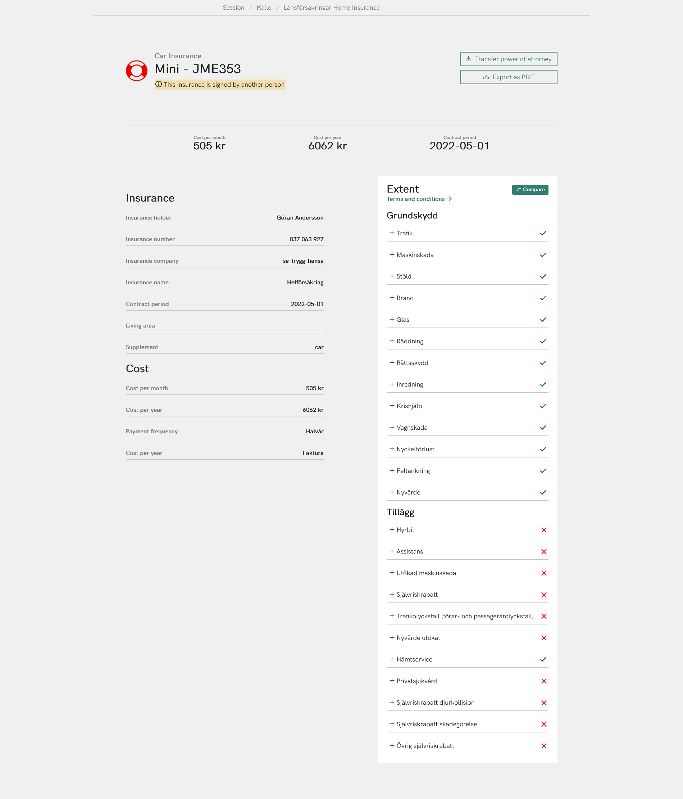
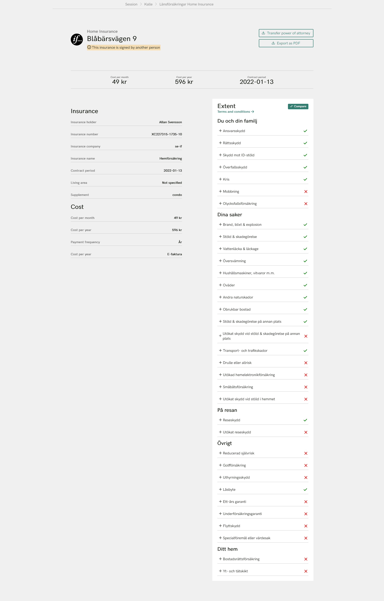

# React code case

We have created a skeleton for a web application that displays detailed information about an insurance, but it doesn't do that yet. Your task is to implement the provided design for the insurance page. Do as much as you can in no more than 3-4 hours.

**Focus on the implementation of the design**. The actual functionality of the page is secondary.

All necessary insurance details provided. One item for home insurance. And one for car. Start with an insurance policy. And do the other if you have time.

Don't be afraid to ask if you have any questions!

Good luck!

## Building and running

- npm i

- npm start

## The design

